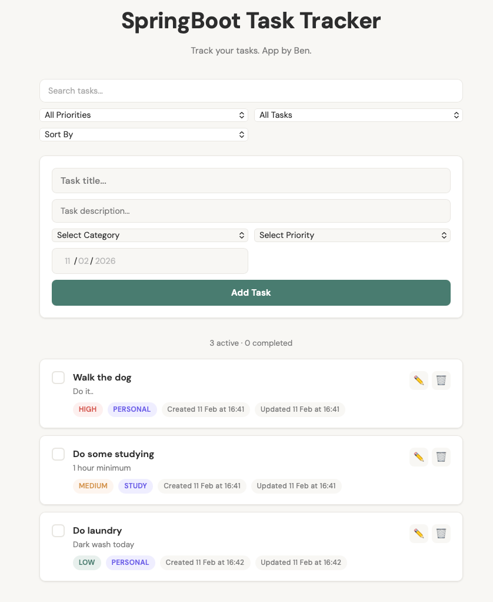

# Task Tracker

A full-stack task management application built with Spring Boot and vanilla JavaScript.

Built as a learning project during the Version 1 Digital Skills Academy.



## Features
- Full CRUD operations (Create, Read, Update, Delete)
- Task priority levels (HIGH, MEDIUM, LOW)
- Task categories (WORK, PERSONAL, STUDY, HEALTH, FINANCE)
- Task descriptions
- Due dates with overdue detection
- Auto-timestamps (createdAt, updatedAt)
- Filter tasks by priority, completion status, or both combined
- Search tasks by title (case-insensitive)
- Sort by due date, priority, or date created
- Inline task editing
- Input validation with custom exception handling
- Layered architecture (Controller → Service → Repository)
- Clean, responsive frontend UI

## Technologies Used
- Java 21
- Spring Boot
- Spring Data JPA
- H2 In-Memory Database
- Maven
- HTML / CSS / JavaScript

## Getting Started

### Prerequisites
- Java 21 or higher installed
- Maven installed (or use the included Maven wrapper)

### Installation

1. Clone the repository:
```bash
git clone https://github.com/BenHMackay/task-tracker.git
cd task-tracker
```

2. Run the application:
```bash
./mvnw spring-boot:run
```

3. Open your browser and go to:
```
http://localhost:8080
```

That's it! The app uses an in-memory H2 database so no database setup is needed. Note that data resets when the app restarts.

### API Endpoints

| Method | Endpoint | Description |
|--------|----------|-------------|
| GET | /tasks | Get all tasks |
| GET | /tasks/{id} | Get task by ID |
| POST | /tasks | Create a new task |
| PUT | /tasks/{id} | Update a task |
| DELETE | /tasks/{id} | Delete a task |

### Query Parameters

| Parameter | Example | Description |
|-----------|---------|-------------|
| priority | /tasks?priority=HIGH | Filter by priority |
| completed | /tasks?completed=true | Filter by completion status |
| keyword | /tasks?keyword=spring | Search by title |
| sort | /tasks?sort=dueDate | Sort results |

### Example Request

```json
POST /tasks
{
    "title": "Learn Spring Boot",
    "description": "Build a task tracker REST API",
    "priority": "HIGH",
    "category": "STUDY",
    "dueDate": "2025-03-01"
}
```

## Future Improvements
- DTOs (Data Transfer Objects) for API security
- Unit and integration tests
- Additional validation on priority and due date fields
- Persistent database (PostgreSQL/MySQL)
